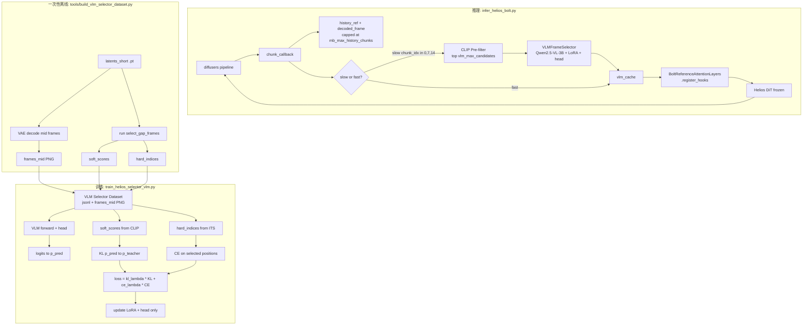

# VLM Selector：以 CLIP+ITS 为教师的"即插即用"高粒度选帧器

> 关联文档：
>
> - [bolt_integration_plan.md](bolt_integration_plan.md)：当前 CLIP+ITS + Bolt Ref-Attn 的全链路（必须先读）
> - [selector_vlm_review.md](selector_vlm_review.md)：早期 VLM Selector 方案审阅（与本文方案**不同**：早期方案改动 attention 拓扑；本文方案保持 Bolt Ref-Attn 不变）
> - [selector_vlm_data_guide.md](selector_vlm_data_guide.md)：可复用的元数据与数据集构建规范

---

## 0. TL;DR

把"CLIP + ITS"换成"**VLM 选帧器**"，但**严格保持下游接口与 Bolt Ref-Attn 完全一致**——
即 selector 仍然返回 `(selected_latents, selected_indices)`，注入仍走 `BoltReferenceAttentionLayers.register_hooks(...)`，
DiT / VAE / pipeline / chunk_callback 全部零修改。

新增三件事：

1. `helios/modules/select_frames_vlm.py` —— `VLMFrameSelector`，与 `select_gap_frames` 同签名同返回值。
2. `train_helios_selector_vlm.py` —— 用 CLIP+ITS 的分数分布作为软标签，对 VLM（建议 Qwen2.5-VL-3B + LoRA）做蒸馏微调。**只训练 selector，DiT 与 Bolt Ref-Attn 都不动**。
3. **Memory Bank 的 fast/slow 双速更新**：在 prompt 边界 chunk 调用一次 VLM（slow step），其它 chunk 直接读上一次缓存（fast step）。具体：interactive 模式下 `interpolate_time=7, interpolate_steps=3, prompts=3` → 在 `chunk_idx ∈ {0, 7, 14}` 触发 slow step，其余全部 fast step。

并且 VLM 选帧器在推理时支持两种**输出策略**（都兼容“选多帧”）：

- **ITS 采样（默认）**：`logits → softmax → ITS`，可用 `vlm_power` 控制锐度，行为与现有 CLIP+ITS 对齐。
- **不带 ITS 的最高分直出**：直接取 `top-k`（或 `top-1`）的最高分候选，得到确定性的 `selected_indices`（更稳定、更好复现）。

并通过 **Memory Bank Cap + VLM Pre-filter 两层节流**（见 §2.3）保证长视频推理 / 训练时 VLM 不会 OOM。

补充（已落地）：引入 **LongMemory（cut-gated codebook）** 作为推理时的“何时检索/更新”层，和 VLM Selector 形成二阶段检索：

- **codebook 更新（write / merge）**：用 DINOv2 对每个 chunk 的**尾帧**提 embedding `e_tail`，与 codebook 槽位做余弦相似度；
  若 `max_sim >= τ_merge` 则 EMA 刷新该槽位，否则新增槽位；槽位里同时保存 `embedding key + latent`（注入用），像素帧不长期缓存。
- **cut gate 检索（read / retrieve）**：slow step 里若检测到边界切换（`1 - cos(e_prev, e_curr) >= τ_cut`）才从 codebook 取 top-M 候选；
  然后**按需从 latent decode** 出候选的 `middle_frame` 供 VLM 精排，最终输出 top-k latent 注入 DiT。

该层的目标是：**连续段不乱检索**（避免误匹配），**切换段才花算力做长程回忆**（更符合 long video inference）。

---

## 1. 与现有 CLIP+ITS 的接口对齐（不动 Bolt Ref-Attn）

### 1.1 现有接口（`bolt_integration_plan.md` 已落地）

```text
chunk_callback(chunk_idx, chunk_latents)
  ├── extract_chunk_feature() → 把 (chunk_idx, latent_cpu, clip_feat) 塞进 history_ref
  ├── select_gap_frames(history_ref, next_chunk_idx, prompt, clip_model, k, alpha, power)
  │       → return selected_latents: list[(B,C,T,H,W)],  selected_indices: list[int]
  └── BoltReferenceAttentionLayers.register_hooks(transformer, selected_latents=...)
```

参考实现：[helios/modules/select_frames.py](../helios/modules/select_frames.py)、
[infer_helios_bolt.py](../infer_helios_bolt.py) 第 168–267 行。

### 1.2 VLM 接口契约（保持完全一致）

```python
# helios/modules/select_frames_vlm.py
class VLMFrameSelector:
    def __init__(self, vlm_model_path, lora_path=None, device="cuda",
                 k=4, power=2.0, min_chunk_distance=3): ...

    @torch.no_grad()
    def __call__(
        self,
        history,             # list[{"chunk_idx", "latent" (CPU), "clip_feat" (CPU), "decoded_frame" (PIL)}]
        current_chunk_idx,   # int
        current_prompt,      # str
    ) -> tuple[list[torch.Tensor], list[int]]:
        """
        与 select_gap_frames 完全相同的返回签名：
          selected_latents: list of (B, C, T, H, W)
          selected_indices: list of int
        """
```

> **关键约束**：
>
> - 不修改 `BoltReferenceAttentionLayers`、`patchify_selected_latents`、`register_hooks`。
> - `history_ref` 字典里可包含 `"decoded_frame"` 字段（PIL Image）。在当前实现中，为了节省 RAM，像素帧默认**不长期缓存**，只在需要 VLM 精排时按需从 latent decode 出 `middle_frame`。
> - `clip_feat` 字段保留（同时用作 §2.3 的 VLM pre-filter 粗筛依据）。
> - LongMemory 路径下 `history_ref` 额外存 `"tail_emb"`（DINOv2 尾帧 embedding，用于 codebook 更新与 cut gate）。

### 1.3 即插即用切换（`infer_helios_bolt.py` 改动量 ≤ 30 行）

```python
# infer_helios_bolt.py
if args.selector_type == "clip_its":
    selector = lambda hist, idx, prm: select_gap_frames(
        hist, idx, prm, clip_model, k=args.bolt_k_select, alpha=args.bolt_alpha,
        power=args.bolt_power, min_chunk_distance=args.bolt_min_chunk_distance, device=device)
elif args.selector_type == "vlm":
    selector = VLMFrameSelector(...)  # 同签名

# chunk_callback 内部只换一行：
selected_latents, selected_indices = selector(history_ref, next_chunk_idx, clip_prompt)
```

新增 CLI（节选）：

- Selector 路由：`--selector_type {clip_its, vlm, vlm_zeroshot, random}`
- VLM：`--vlm_model_path`、`--vlm_lora_path`、`--vlm_rank_mode {its,topk}`、`--vlm_slow_step_chunks "0,7,14"`
- LongMemory：`--enable_long_memory`、`--dino_model_path`、`--lm_tau_merge`、`--lm_tau_cut`、`--lm_ema_alpha_new`、`--lm_codebook_max_size`、`--lm_codebook_topm`、`--lm_codebook_evict`、`--lm_debug`

---

## 2. VLM 设计

### 2.1 输入构造（与你手写图一致）

```text
VLM input:
  ├── 视觉:  GAP 区间所有候选帧的中间帧 (PIL list, 经 §2.3 节流后最多 vlm_max_candidates 张)
  │          + 当前 chunk 的"上一帧"  (history_ref[next_chunk_idx-1]["decoded_frame"])
  └── 文本:  DiT prompt 模板:
             "Below are {N_cand} candidate frames from the past video, and the latest
              context frame is the last one. Given the upcoming generation prompt:
              \"{current_prompt}\", select the {k} candidate indices most relevant
              to continue this prompt."
```

### 2.2 输出形式（推荐 A，备选 B/C 在 §6 辩证讨论）

**推荐 A：候选位上的软分布 + ITS 采样**（与 CLIP+ITS 同构）

在 VLM 的 LM head 之外，挂一个**轻量分类头**（`nn.Linear(hidden_dim, 1)`，对每个候选帧的最后一个 visual-token 做打分）→ 得到 `vlm_scores ∈ R^{N_cand}`；
默认再走与 CLIP 完全相同的 `inverse_transform_sampling(vlm_scores, n=k, power=power)`。

> **已落地增强：支持“选多帧”与“无 ITS 直出 top-k”**
>
> - **选多帧**：本方案天然支持 `k>1`（即 `vlm_k_select`），输出的 `selected_latents / selected_indices` 都是 list。
> - **无 ITS**：推理时可切换到确定性的 top-k（或 top-1）策略：直接取 `vlm_scores` 最大的 k 个位置作为 `selected_indices`，不再做 ITS 采样。

> **澄清（针对你的 Q3：VLM 是否同时输出 logits 和 idx？）**
>
> A 路径下 **VLM 只产出一个东西** —— `logits ∈ R^{N_cand}` 这个分数向量。
> KL loss 和 CE loss 都基于**同一个** `softmax(logits/τ)` 分布算出来，只是 ground truth 端有两种监督信号：
>
> ```python
> p_pred  = softmax(logits / τ)                          # 唯一输出
>
> # GT 一: CLIP combined_scores（对所有 N_cand 候选打的连续分）
> p_teach = softmax(soft_scores / τ_teacher)
> loss_kl = KL(p_pred || p_teach)                        # 软对齐
>
> # GT 二: ITS 实际抽中的位置（离散 hard indices，长度=k）
> loss_ce = -log(p_pred[hard_indices]).mean()            # 硬补强
>
> loss = kl_lambda * loss_kl + ce_lambda * loss_ce       # 经典 Hinton-style soft+hard 双蒸馏
> ```
>
> 也就是说，**A 路径 VLM 的输出端只有一个 logits 头**；hard_indices 是 GT 的另一种视图，不是 VLM 自己再输出一份。
> 真正"VLM 同时输出 logits + 文本 indices"的是 §6.3 的 **C 路径**，那才是工程量翻倍的"双输出"模式。

**为什么推荐 A**：

- 选帧规则、ITS 锐度、min_chunk_distance 等推理时超参全部沿用，调参经验 100% 复用。
- 软分布天然支持蒸馏（KL/MSE）；不会因 "VLM 偶尔生成非法 JSON" 而崩。
- 如果 VLM 失效，可以一行降级回 CLIP（统一签名）。

### 2.3 显存与节流（训练 / 推理双视角，回答 Q1）

> 这是 selector 落地的**真正瓶颈**，必须在设计阶段就锁死，否则长视频推理一定会 OOM。

#### 2.3.1 训练阶段：是否提前存好 mid frame？会不会显存过载？

**结论：是提前离线存到磁盘，但训练时按需读取，不会过载。**

- 中间帧 PNG 由 `tools/build_vlm_selector_dataset.py` **一次性离线**生成到 `frames_mid/{uttid}/chunk_XX.png`，每张 480×832 RGB 约 **30–80 KB on disk**，1000 个视频 × 平均 4 chunks ≈ 200 MB 磁盘，可忽略。
- 训练 dataloader **按样本按需读取**：每条样本只 decode `N_cand + 1` 张 PNG（典型 5–9 张），480×832 RGB 解码到 GPU 后约 `1.2 MB/张` × 8 张 ≈ **10 MB GPU 显存**，可忽略。
- **真正吃显存的是 VLM forward 的 visual token 数**：Qwen2.5-VL 默认 480×832 ≈ 700–1100 tokens/张；`N_cand=8` 就是 5500–8800 visual tokens，叠加 LoRA + AdamW 状态可能撑爆中端卡。
- **缓解**：训练时统一 `vlm_image_resize=[256, 448]` → 256–384 tokens/张，`N_cand≤8` 时总 visual tokens < 3500，3B + LoRA + AdamW 在单卡 H800 80GB 上轻松装下。

> **不需要"同时加载所有数据"**：dataloader 是按 batch 流式读，不是一次性载入。`50 视频 × ~5 chunks = 250 张 PNG ≈ 15 MB`，就算全 load 进 RAM 也无压力。

#### 2.3.2 推理阶段（长视频，关键）

如果不加节流，`history_ref` 会随着生成不断增长。100 chunk 时 `N_gap` ≈ 100，会同时炸两个东西：

| 资源 | 不加节流 | 现象 |
| ---- | -------- | ---- |
| CPU RAM (history_ref) | 100 × (1.8 MB latent + 1.2 MB PIL) ≈ 300 MB | 还能扛 |
| VLM 显存 (visual tokens) | 100 × 384 = 38 400 tokens | **直接 OOM** |

**强制启用两层节流**：

```text
history_ref（无限增长，每生成一 chunk 增长一项）
  → [Memory Bank Cap]   保留最近 mb_max_history_chunks=32 个 chunk
  → [VLM Pre-filter]    CLIP 粗筛 vlm_max_candidates=16 张候选送进 VLM
  → [VLM 精排 + ITS]    选最终 vlm_k_select=4 张
  → [Bolt Ref-Attn]     与现版完全相同
```

| 层 | 关键参数 | 默认 | 作用 |
| --- | --- | --- | --- |
| **Memory Bank Cap** | `mb_max_history_chunks` | 32 | history_ref 硬上限（CPU RAM ~100 MB） |
|                     | `mb_evict_strategy` | `farthest_lowclip` | 按"距 target 最远 + CLIP 分最低"驱逐 |
|                     | `mb_keep_recent_k` | 8 | 最近 8 个永不驱逐（保护时间局部性） |
|                     | `mb_cache_decoded_frame` | true | 关掉则 slow step 时再 decode（省 RAM 但慢） |
| **VLM Pre-filter**  | `vlm_prefilter_enable` | true | 关掉则 VLM 看全部 history（不推荐） |
|                     | `vlm_prefilter_method` | `clip_topm` | 复用 CLIP `compute_similarity` 取 top-M |
|                     | `vlm_max_candidates` | 16 | 送 VLM 的最多候选数（VLM tokens ≤ 16 × 384） |

**关键设计含义**：VLM **不是**取代 CLIP，而是 **CLIP 粗筛 + VLM 精排** 的两级 selector。这反而更贴合两者各自强项——CLIP 擅长 embedding 相似度粗排（O(N) 廉价），VLM 擅长语义精排（O(M) 昂贵但高质）。同时这也保证 VLM 失败时可以无缝降级到 CLIP（统一接口）。

### 2.4 Backbone 与微调策略（推荐 + 备选）

| 选项 | 显存（fp16） | 训练显存（LoRA） | 推理延迟（单 chunk） | 备注 |
| ---- | ------------ | ---------------- | -------------------- | ---- |
| **推荐：Qwen2.5-VL-3B + LoRA r=16** | ~6 GB | ~12 GB（含 head） | 200-400 ms | 与 14B DiT group offload 共栖一卡 |
| 备选 1：Qwen2.5-VL-7B + LoRA r=8 | ~14 GB | ~22 GB | 600-1200 ms | 语义更强，但需更激进 offload |
| 备选 2：InternVL2-2B 全参 | ~5 GB | ~14 GB | 150-300 ms | 数据多时上限更高，但训练更贵 |
| 备选 3：MiniCPM-V-2.6 LoRA | ~7 GB | ~13 GB | 250 ms | 视频帧采样能力强 |

**默认起步：Qwen2.5-VL-3B + LoRA**（理由：单卡可跑、开源生态成熟、`transformers` 官方 video pipeline 完整）。
LoRA 只挂在 `attn.q_proj / k_proj / v_proj / o_proj`；分类头随 LoRA 一起训。

### 2.5 完整新增配置参数清单（回答 Q2，含详细注释）

按"yaml + CLI 双层覆盖"组织（与 [bolt_integration_plan.md](bolt_integration_plan.md) 相同范式）。
yaml 路径：`scripts/training/configs/selector_vlm.yaml`；推理时通过 `infer_helios_bolt.py` 的 CLI 一一对应覆盖。

```yaml
# ══════════════════════════════════════════════════
# 1. Selector 路由（infer_helios_bolt.py 顶层开关）
# ══════════════════════════════════════════════════
selector_type:           "vlm"                  # clip_its | vlm | random（debug 用）
vlm_fallback_to_clip:    true                   # VLM 失败/超时 → 自动降级 CLIP+ITS

# ══════════════════════════════════════════════════
# 2. VLM Backbone
# ══════════════════════════════════════════════════
vlm_model_path:          /root/autodl-fs/Qwen2.5-VL-3B-Instruct
vlm_lora_path:           null                   # 推理用（训练时由 train 脚本输出）
vlm_image_resize:        [256, 448]             # 控制每张图的 visual tokens 数
vlm_dtype:               bfloat16
vlm_offload_to_cpu:      true                   # slow step 后立即 .to('cpu')，腾显存给 DiT
vlm_temperature:         0.7                    # softmax(logits/τ)，推理 & 训练共用
vlm_max_new_tokens:      32                     # 仅 B/C 路径用（A 路径不调 generate）

# ══════════════════════════════════════════════════
# 3. Memory Bank（关键：保证长视频推理不 OOM）
# ══════════════════════════════════════════════════
mb_max_history_chunks:   32                     # history_ref 长度硬上限（超过即按 mb_evict_strategy 驱逐）
                                                # 直接决定 CPU RAM 占用：32 × (1.8MB latent + 1.2MB PIL) ≈ 100 MB

mb_evict_strategy:       "farthest_lowclip"     # 驱逐策略，三选一：
                                                #   oldest           - FIFO，丢 chunk_idx 最小的（最老的）。最简单，
                                                #                      但可能丢掉"远但语义关键"的镜头
                                                #   lru              - Least Recently Used，丢"最久没被 selector 选中过"的
                                                #                      跟实际选帧偏好对齐；需要额外维护 last_used_at 字段
                                                #   farthest_lowclip - 综合打分 = α·time_distance + (1-α)·(1 - clip_to_recent)
                                                #                      丢分最高的"既远又不像"的 chunk
                                                #                      （默认推荐：贴近 CLIP+ITS 选帧准则、不需额外状态、
                                                #                       直接复用 history_ref 已有的 clip_feat）

mb_keep_recent_k:        8                      # 最近 K 个 chunk 永不驱逐（保护时间局部性，避免误丢上下文）
mb_cache_decoded_frame:  true                   # true=history_ref 直接存 PIL（slow step 时直接用）
                                                # false=不存，slow step 时再调 VAE.decode（省 RAM 但 slow step 变慢）

# ══════════════════════════════════════════════════
# 4. VLM Pre-filter（CLIP 粗筛，关键节流）
# ══════════════════════════════════════════════════
vlm_prefilter_enable:    true                   # 关掉则把整个 history 直接灌给 VLM（极易 OOM，仅用于 ablation）
vlm_prefilter_method:    "clip_topm"            # 粗筛策略，三选一：
                                                #   clip_topm     - 用 CLIP 的 α·visual + (1-α)·text combined_score 取 top-M
                                                #                   （默认推荐：零额外开销，复用 CLIP+ITS 已经在算的分数）
                                                #   uniform       - 在 history 上等距均匀采样 M 张
                                                #                   （ablation baseline，验证 CLIP 粗筛是否真的有效）
                                                #   recent_window - 取最近 M 个 chunk（极端 baseline / CLIP 失败时的兜底）

vlm_max_candidates:      16                     # M：粗筛后【送进 VLM 的候选数】= VLM 输入端"看几张图"
                                                # 直接决定 VLM 显存：≈ M × visual_tokens_per_image
                                                # 注意区分 vlm_k_select（见下）：
                                                #   vlm_max_candidates → VLM 看几张
                                                #   vlm_k_select       → VLM 看完后【最终选几张】注入 DiT

# ══════════════════════════════════════════════════
# 5. VLM Selection（VLM 精排 + ITS 输出端，沿用 CLIP+ITS 经验）
# ══════════════════════════════════════════════════
vlm_k_select:            4                      # k：VLM 打完分 + ITS 采样后【最终】选几帧注入 Bolt Ref-Attn
                                                # 与 bolt_k_select 对齐，决定 Ref-Attn 的注入强度
                                                # 完整流水线：history(任意长) → cap=32 → prefilter=16 → VLM精排+ITS → k=4 → 注入
                                                # vlm_max_candidates=16 决定"VLM 显存压力"
                                                # vlm_k_select=4       决定"DiT Ref-Attn 注入端的 patches 数"
vlm_select_strategy:     "its"                  # its | topk
                                                # its : softmax(logits/τ) 后做 ITS（默认，行为对齐 CLIP+ITS）
                                                # topk: 不做 ITS，直接按 logits 取最高分 top-k（确定性、便于复现实验）
vlm_power:               2.0                    # ITS 锐度（≈ bolt_power）：>1 集中高分帧，<1 趋向均匀
vlm_min_chunk_distance:  3                      # 与 target 的最小 chunk 距离（跳过最近两段，避免选到太近的）

# ══════════════════════════════════════════════════
# 6. Slow / Fast 调度（推理专属）
# ══════════════════════════════════════════════════
vlm_slow_step_auto:      true                   # 按 interpolate_time_list 自动推断 slow chunk 集合
vlm_slow_step_chunks:    null                   # 显式覆盖（如 "0,7,14"），优先级高于 auto
vlm_cache_invalidate_on_evict: true             # cache 引用的 latent 被 memory bank 驱逐时 → 强制 mini-slow 重选
vlm_extra_slow_at_segment_mid: false            # 是否在每个 prompt 段中点也插一次 slow（共 6 次/视频）
                                                # 段内漂移严重的 long-prompt 时打开

# ══════════════════════════════════════════════════
# 7. 训练专属（推理不需要）
# ══════════════════════════════════════════════════
training:
  data_jsonl:            /root/autodl-fs/selector_vlm_data/train.jsonl
  frames_dir:            /root/autodl-fs/selector_vlm_data/frames_mid

  kl_lambda:             1.0                    # KL 蒸馏权重（主目标，软对齐）
                                                # 监督：KL(softmax(VLM_logits/τ) || softmax(CLIP_combined_scores/τ_teacher))
                                                # 让 VLM 学到 CLIP 教师对【全部 N_cand 个候选】的整体相对排序
                                                # 软标签信息量大（连续 N_cand 维），承担主要优化方向

  ce_lambda:             0.3                    # CE 硬监督权重（辅助目标，硬补强）
                                                # 监督：-log P(VLM_softmax)[hard_indices].mean()
                                                # 让 VLM 在【ITS 实际选中的 k 个位置】上分配高概率
                                                # 硬标签信息量小（只有 k 维 one-hot），但能防止"排序对了但峰值压不上去"
                                                # 经典 Hinton 蒸馏配方：kl_lambda > ce_lambda
                                                # 调参建议：实测 VLM 排序对但 top-k 选不准 → 调大到 0.5~1.0；反之调小

  temperature_teacher:   0.5                    # 教师 softmax 温度：τ_teacher 越小，p_teach 越尖锐（强调 top-k）
  lora_r:                16
  lora_alpha:            32
  lora_dropout:          0.05
  lora_target_modules:   ["q_proj","k_proj","v_proj","o_proj"]
  vlm_lr:                2.0e-4                 # LoRA 学习率
  head_lr:               5.0e-4                 # 选帧头学习率（小模块，可大一点）
  batch_size:            4
  grad_accum_steps:      4
  num_epochs:            10
  warmup_steps:          200
```

CLI 一一对应（snake_case → `--snake_case`），例如：

```bash
python infer_helios_bolt.py \
  --selector_type vlm \
  --vlm_model_path /root/autodl-fs/Qwen2.5-VL-3B-Instruct \
  --vlm_lora_path /root/autodl-fs/output/selector_vlm_epoch09 \
  --mb_max_history_chunks 32 \
  --mb_evict_strategy farthest_lowclip \
  --vlm_prefilter_method clip_topm \
  --vlm_max_candidates 16 \
  --vlm_k_select 4 \
  --vlm_slow_step_chunks "0,7,14" \
  --vlm_offload_to_cpu \
  --interactive_prompt_csv_path example/prompt_interactive_helios_2.csv \
  --use_interpolate_prompt --interpolation_steps 3 --interpolate_time 7
```

### 2.6 参数语义辨析（vlm_max_candidates vs vlm_k_select 等易混淆点）

```text
                       一条 chunk_callback 的完整数据流
─────────────────────────────────────────────────────────────────────────────
┌─────────────┐
│ history_ref │  长度 = N_history（任意长，每生成一 chunk 增一）
└──────┬──────┘
       │  ① Memory Bank Cap（mb_max_history_chunks=32, mb_evict_strategy）
       ▼
┌─────────────┐
│  capped     │  长度 ≤ 32（CPU RAM 上限 ~100 MB）
│  history    │
└──────┬──────┘
       │  ② VLM Pre-filter（vlm_prefilter_method=clip_topm(已有)/uniform distribution/recent windows, vlm_max_candidates=16）
       ▼
┌─────────────┐
│ candidates  │  长度 = M = 16  ←──  这是【VLM 看多少张图】
│ for VLM     │                    决定 VLM forward 的 visual_tokens 数
└──────┬──────┘                    决定 VLM 显存占用
       │  ③ VLM forward + head logits → softmax → ITS sampling
       │     (vlm_temperature, vlm_power, vlm_min_chunk_distance)
       ▼
┌─────────────┐
│ selected    │  长度 = k = 4   ←──  这是【最终注入到 DiT 的帧数】
│ for inject  │                    决定 Bolt Ref-Attn 的 K/V patches 数
└──────┬──────┘                    决定 Ref-Attn 的注入强度
       │  ④ patchify + register_hooks
       ▼
   Helios DiT
```

**两者关系一句话**：
`vlm_max_candidates` 是 **VLM 输入端的"宽度"**（VLM 看几张），`vlm_k_select` 是 **DiT 输入端的"宽度"**（DiT 真正注入几张）。
前者控制 VLM 显存，后者与已训好的 Bolt Ref-Attn `bolt_k_select` 对齐。

**典型取值组合**：

| 场景 | mb_max | max_cand | k_select | 说明 |
| --- | --- | --- | --- | --- |
| 默认（H800 80GB） | 32 | 16 | 4 | 与 `train_helios_bolt.py` 默认 `bolt_k_select=4` 对齐 |
| 显存吃紧 | 16 | 8 | 4 | VLM 输入减半，注入强度不变 |
| 长视频（200+ chunks） | 64 | 16 | 4 | 给 memory bank 多点容量 |
| 注入更强（重训 Bolt） | 32 | 24 | 8 | 需要把 `bolt_k_select` 也调到 8 重训 |

---

## 3. 训练流程：以 CLIP+ITS 为软标签做蒸馏

### 3.1 数据来源（直接复用 Bolt 的 `latents_short`）

复用 [bolt_integration_plan.md](bolt_integration_plan.md) §"自建数据集详细流程" 已经准备好的 `.pt` 文件：

```text
{uttid}_{num_frame}_{H_lat}_{W_lat}.pt
  ├── vae_latent  (num_chunks, 16, 9, H_lat, W_lat)
  ├── prompt_embed
  └── prompt_raw
```

**离线一次性预处理**（`tools/build_vlm_selector_dataset.py`，新增）：

1. 对每个 .pt：`vae_latent → VAE.decode(每个 chunk 的中间帧)` → 保存 `frames_mid/{uttid}/chunk_XX.png`（约 `num_chunks` 张/视频，<80 KB/张）。
2. 对每对 `(choice_idx, history_window)`，调用现成的 `select_gap_frames`（CLIP+ITS）得到 `combined_scores ∈ R^{N_gap}` 和 `selected_indices`。
3. 序列化为训练样本：

```jsonl
{"uttid": "0001_97_60_104",
 "choice_idx": 5,
 "gap_chunk_indices": [0, 1, 2],
 "context_chunk_idx": 4,
 "prompt_raw": "A young woman walking ...",
 "soft_scores":  [0.62, 0.35, 0.81],   # CLIP combined_scores（min-max 归一化）
 "hard_indices": [2, 0]}                # CLIP+ITS 实际选中的位置（索引到 gap_chunk_indices）
```

> 当 `len(gap_chunk_indices) > vlm_max_candidates` 时，离线预处理也要按 `vlm_prefilter_method` 先粗筛，**保证训练分布与推理分布一致**（避免训练 N_gap=3 推理 N_cand=16 的 mismatch）。

**优点**：训练时无需重复跑 CLIP / VAE，数据集大小约 `n_videos × avg_chunks` 条样本（50 视频 × 3 chunks × ~5 choice ≈ 750 条），对 LoRA 充足。

### 3.2 训练脚本：`train_helios_selector_vlm.py`（新建，独立于 `train_helios_bolt.py`）

```text
forward(sample):
    images   = [load(frames_mid/{uttid}/chunk_{i}.png) for i in gap_chunk_indices]
              + [load(context_chunk_idx)]
    text     = build_prompt_template(prompt_raw, k=len(hard_indices))
    h        = vlm_backbone(images, text)              # (N_cand, hidden) ← 取每个候选最后 visual-token
    logits   = head(h).squeeze(-1)                     # (N_cand,)  ← 唯一输出
    p_pred   = softmax(logits / τ)
    p_teach  = softmax(soft_scores / τ_teacher)

    # 主目标：教 VLM 模仿 CLIP 教师的整体相对排序
    loss_kl  = KLDiv(p_pred || p_teach)
    # 辅助目标：让 VLM 在 ITS 实际选中的 k 个位置上分配高概率
    loss_ce  = -log p_pred[hard_indices].mean()

    loss = kl_lambda * loss_kl + ce_lambda * loss_ce
```

**冻结**：

- 冻结：VAE、CLIP、Helios DiT、Bolt Ref-Attn、VLM 主干（除 LoRA 部位）。
- 可训：VLM 的 LoRA 适配器 + 1 个 `nn.Linear(hidden, 1)` 选帧头。

**显存预算（H800 80GB，单卡）**：VLM 3B + LoRA + AdamW ≈ 12 GB；CLIP/VAE 不需要在训练时加载（已离线预处理）；DiT 不参与，整张卡轻松。

**默认超参（起步，已写进 §2.5 yaml）**：`bs=4, grad_accum=4, vlm_lr=2e-4, head_lr=5e-4, epochs=10, τ=0.7, kl_lambda=1.0, ce_lambda=0.3`。

### 3.3 评估指标（每个 epoch 跑一次）

| 指标 | 含义 |
| ---- | ---- |
| `top-k recall` | VLM 选的 top-k 与 CLIP+ITS hard_indices 的重叠率 |
| `KL(p_pred || p_teacher)` | 软分布对齐度 |
| `spearman(p_pred, soft_scores)` | 候选排序一致性 |
| `e2e MSE @ frozen DiT`（可选） | 用 VLM 选出的 latents → 跑一次 frozen Helios+Bolt Ref-Attn → 与不注入比较 ΔMSE |

---

## 4. Memory Bank：fast / slow 双速更新

### 4.1 现有 history_ref 即"原始 memory bank"，VLM 路径加 cap + cache

```python
history_ref = list of {
    "chunk_idx", "latent" (CPU), "clip_feat" (CPU),
    "decoded_frame": PIL.Image,   # 可选（VLM 精排输入）；当前实现默认不长期缓存，按需 decode
    "tail_emb": Tensor,           # 新增（LongMemory 路径）：DINOv2 尾帧 embedding，用于 codebook/cut gate
}
# 长度受 §2.3 mb_max_history_chunks 硬上限保护

LongMemory codebook slot（概念结构）：

```text
CodebookEntry
  - key: embedding prototype (DINOv2, L2-norm)
  - chunk_idx: absolute index
  - latent: VAE latent (CPU) for direct injection
  - decoded_frame: optional, usually None (decode-on-demand)
  - hits / last_used_at / created_at: eviction meta
```

vlm_cache = {
    "valid_for_chunks": set[int],          # 这次缓存覆盖哪些 target chunk
    "selected_chunk_idx": list[int],       # 选中的 chunk_idx（绝对位置，非 list 下标）
    "selected_latents": list[Tensor],      # 与 select_gap_frames 同格式
    "selected_indices": list[int],
    "computed_at_chunk": int,
    "for_prompt": str,
}
```

> **fast step 的 cache 失效保护**：fast step 会按 `selected_chunk_idx` 从最新 `history_ref` 重新取 latent。如果某个 idx 已被 `mb_evict_strategy` 驱逐（罕见，因为 `mb_keep_recent_k` 和 slow step 的 idx 通常较"近"），按 `vlm_cache_invalidate_on_evict=true` 触发一次 mini-slow（只调 VLM 重选缺失的几帧，或全降级到 CLIP top-k）。

### 4.2 调度规则（与你举例严格对齐）

interactive 模式下 `interpolate_time=7, interpolate_steps=3, prompts=3`，pipeline 共生成 `3*7=21` 个 chunk：

```text
chunk_idx:  0 1 2 3 4 5 6 | 7 8 9 10 11 12 13 | 14 15 16 17 18 19 20
prompt:     prompt_0      | prompt_1          | prompt_2
slow step:  ●(=cold start)  ●                   ●
fast step:  - 6 个         - 6 个               - 6 个
```

- **slow step**（`chunk_idx ∈ {0, 7, 14}`，即"prompt 段起点 / prompt 切换处"）：
  1. 先把刚生成的 chunk 追加进 `history_ref`（含 decoded middle frame），并执行 Memory Bank 驱逐策略。
  2. **调用 VLM** 一次：`vlm_selector(history_ref, next_chunk_idx, clip_prompt_for_next_segment)`。内部先做 CLIP pre-filter → VLM 精排 → ITS。
  3. 把结果写入 `vlm_cache`，标记 `valid_for_chunks = {7..13}` 之类的下一个 prompt 段。
  4. `register_hooks(transformer, selected_latents=cache.selected_latents)`。
  5. 完成后立即 `vlm.to('cpu')`（`vlm_offload_to_cpu=true`）腾出显存给 DiT 继续生成。
- **fast step**（其它所有 chunk）：
  1. 仍照常更新 `history_ref`（保留 latent，方便下一次 slow step 调用）。
  2. **不调 VLM**，按 `vlm_cache.selected_chunk_idx` 从 `history_ref` 取最新 latent，重新挂 hook。
  3. 可选地"轻量校正"：用 CLIP combined_score 在 cache 内部小幅 reorder，但**不引入新帧**。

> **chunk_idx=0 的特例**：history 里还没有 GAP，VLM 也无可选；与 CLIP+ITS 一致——直接 `selected_latents=[]`，hook 不注入。

### 4.3 何时是 slow step：自动推断

```python
def is_slow_step(chunk_idx, interpolate_time_list, extra_mid=False):
    boundaries = list(accumulate(interpolate_time_list))   # [7, 14, 21]
    seg_starts = [0] + boundaries[:-1]                      # [0, 7, 14]
    triggers = set(seg_starts)
    if extra_mid:
        for s, e in zip(seg_starts, boundaries):
            triggers.add(s + (e - s) // 2)                  # 段中点 [3, 10, 17]
    return chunk_idx in triggers
```

可被 CLI `--vlm_slow_step_chunks "0,7,14"` 显式覆盖；
或开 `--vlm_extra_slow_at_segment_mid` 变成 6 次 slow（适合段内漂移严重的 long-prompt）。

### 4.4 推理伪代码（完整）

```python
def chunk_callback(chunk_idx, chunk_latents):
    # ① 永远更新 history_ref（轻量），并执行 cap 驱逐
    clip_feat, mid_frame = extract_chunk_feature(chunk_latents, vae, clip_model, ...)
    history_ref.append({
        "chunk_idx": chunk_idx,
        "latent": chunk_latents.detach().cpu(),
        "clip_feat": clip_feat,
        "decoded_frame": mid_frame if mb_cache_decoded_frame else None,
    })
    memory_bank_evict(history_ref, max_n=mb_max_history_chunks, keep_recent=mb_keep_recent_k,
                      strategy=mb_evict_strategy, current_idx=chunk_idx)

    next_idx = chunk_idx + 1
    next_prompt = _get_clip_prompt_for_next_chunk(prompt_input, next_idx, itl)

    # ② Slow / Fast 调度
    if is_slow_step(next_idx, itl) or vlm_cache is None:
        sel_lat, sel_idx = vlm_selector(history_ref, next_idx, next_prompt)  # 内部含 CLIP prefilter
        vlm_cache.update(sel_lat, sel_idx, next_idx, next_prompt,
                         valid_for=range(next_idx, next_seg_end))
        if vlm_offload_to_cpu:
            vlm_selector.to_cpu()
    else:
        sel_lat, sel_idx = vlm_cache.refresh_latents_from(history_ref)

    # ③ 重挂 Bolt Ref-Attn hooks（与现版完全相同）
    if active_hooks[0] is not None:
        BoltReferenceAttentionLayers.remove_hooks(active_hooks[0])
    if sel_lat:
        active_hooks[0] = bolt_layers.register_hooks(transformer, selected_latents=sel_lat)
```

---

## 4.x 训练 Bolt Ref-Attn 时用 VLM 选帧（已支持）

默认 `train_helios_bolt.py` 训练 Ref-Attn 时使用 **CLIP+ITS** 来选 GAP 参考帧（稳定、无需 VLM）。
为对齐推理阶段的 VLM/LongMemory 路径，现在也支持用 **VLM selector** 选出来的帧来训练 Ref-Attn（可选）。

### 4.x.1 训练侧的差异点（train vs infer）

- **训练（train_helios_bolt.py）**：
  - 每个 step 都会选一次参考帧（为 ref-attn 提供训练信号）。
  - `--selector_type clip_its`：CLIP+ITS（原逻辑）
  - `--selector_type vlm`：decode GAP 候选的 `middle_frame` → VLM 打分 → `topk/its` 选帧 → 注入 ref-attn 训练
  - 训练脚本**不启用 LongMemory/cut gate**（因为训练样本是离线 `.pt`，没有完整推理时的“段内连续/切镜门控”逻辑；如需，可在后续版本加入）。

- **推理（infer_helios_bolt.py）**：
  - fast/slow cache 导致**不是每个 chunk 都跑 selector**；
  - LongMemory `--enable_long_memory` 时，slow step 里也只有 cut gate 触发才会走 codebook→VLM 精排。

### 4.x.2 训练命令示例（VLM 选帧训练 Ref-Attn）

```bash
python train_helios_bolt.py \
  --feature_folders /path/to/precomputed_latents \
  --transformer_path /root/autodl-fs/BestWishYSH/Helios-Base \
  --output_dir /root/autodl-fs/output/bolt_ref_attn_vlmselector \
  --selector_type vlm \
  --vlm_model_path /root/autodl-fs/Qwen2.5-VL-3B-Instruct \
  --vlm_lora_path /root/autodl-fs/output/selector_vlm_epoch09 \
  --vlm_score_mode yes_no \
  --vlm_rank_mode topk \
  --bolt_k_select 4 --bolt_power 2.0 --bolt_min_chunk_distance 3
```

注意：`--vlm_rank_mode topk` 对调试更友好（确定性），后续需要随机性再切 `its`。

## 5. 训练时是否也要 fast/slow？

### 推荐：**训练阶段只做 slow**（每个样本都用 VLM 现算）

- 训练目标是教 VLM 模仿 CLIP+ITS，每条样本都要走 VLM forward；
- fast step 只是推理优化，无需在训练里"模拟缓存命中"；
- 唯一需要在训练里复刻的是**输入分布**：保证训练时的 `(history candidates, context frame, prompt)` 与推理时 slow step 的输入对齐——这个由 §3.1 数据构造（含 pre-filter）保证。

---

## 6. 辩证：方案的优势 / 风险 / 备选

### 6.1 优势（相对于纯 CLIP+ITS）

1. **真正的语义推理**：CLIP 只能对齐"内容相似"；VLM 可以理解"动作连贯性 / 场景延续 / 主体身份"，对 prompt 切换（如人物换衣服、镜头转场）应当显著优于 CLIP。
2. **与现有 Bolt Ref-Attn 完全解耦**：选帧器是 monkey-patch 级的替换，不影响已经训好的 Ref-Attn checkpoint，可同时支持 `--selector_type {clip_its, vlm}` 做 A/B。
3. **fast/slow 把延迟摊薄到几乎为零**：21 chunk 的视频只调 3 次 VLM ≈ 0.6-1.2 s 额外开销，相对总生成时间（数十秒）可忽略。
4. **节流后 VLM 显存可控**：CLIP 粗筛把 N_gap≤16，叠加 fp16 + offload，VLM 不会和 DiT 抢显存。

### 6.2 风险与质疑（必须诚实面对）

| 风险 | 程度 | 缓解 |
| --- | --- | --- |
| **教师天花板**：VLM 蒸馏自 CLIP+ITS，理论上限 = 教师 | 高 | (a) 引入 hard CE + 软 KL 双目标；(b) 训练后期可加入"frozen DiT 的 ΔMSE"作为更贴近最终任务的 oracle（同 [selector_vlm_review.md](selector_vlm_review.md) 的 P_soft 思路） |
| **Train-Test mismatch**：训练用 GT decoded frames，推理用 Helios 自生成（带漂移） | 高 | (a) 训练数据**用 Helios 自己生成的视频**（与 Bolt 训练一致，自蒸馏）；(b) 训练时对 context_frame 加噪声 / VAE 解码再编码 |
| **fast step 期间 history 长出新 chunk，cache 失效** | 中 | cache 只缓存 `selected_chunk_idx`，每次 fast step 仍按这些 idx 从 history_ref 取**最新** latent；若被驱逐则降级到 CLIP top-k |
| **JSON 解析脆弱**（如选 B 路径） | 低（推荐 A 已规避） | 强约束输出 logits，不走文本解析 |
| **VLM 显存与 DiT 抢占** | 中 | (a) Qwen2.5-VL-3B + LoRA + offload；(b) slow step 后立即 `vlm.to('cpu')`；(c) `vlm_max_candidates=16` 限制 visual tokens |
| **slow step 在 prompt 切换处恰恰是最难选帧的位置** | 中（也可视为优势） | prompt 切换正是选帧最关键的时刻，把"一次最贵的算力"花在这里反而合理 |
| **长视频 history 无限增长** | 高（已在 §2.3 解决） | Memory Bank Cap + 驱逐策略，CPU RAM 上限 ~100 MB |

### 6.3 备选输出形式（B / C）的得失

- **A（推荐）**：VLM 输出**唯一一个** `logits ∈ R^{N_cand}`，KL+CE 都基于同一个 softmax(logits) 算（GT 端有 soft + hard 两份）。
- **B：文本生成索引（SFT）**——VLM 输出 `{"selected":[3,7,9]}` 文本，用 next-token CE 训练。优点：与 VLM 原生输出对齐、可解释；缺点：无法直接蒸馏软分布、JSON 失败需 fallback、推理需要 generate(N tokens) 比 logits forward 慢 5-10×。
- **C：A+B 混合**——VLM 同时挂 logits head 和 LM head，三种 loss（KL + CE_soft + CE_text）联合训。优点：兼顾两者；缺点：训练 loss 调权很难、工程复杂度翻倍。
- **结论**：MVP 阶段就用 A，等 A 跑通再考虑加 B 作为可解释性增强。

### 6.4 VLM vs. 直接训练一个"小判别器"

> 反方观点："不就是个候选打分吗，何必上 3B VLM？训一个 ViT-Small + cross-attn 不香吗？"

回应：

- 如果只看 in-distribution 数据，小判别器确实够用（事实上 CLIP+ITS 已经接近这种轻量方案）。
- VLM 的价值在 **out-of-distribution 推理**：理解 prompt 中的概念（"the same woman puts on a coat"）→ 选出"同一女人 + 衣服可能要变"的帧。这是小判别器无法复现的。
- 如果未来 prompt 多样性扩大、出现 long-horizon 叙事，VLM 的语义优势会越来越明显；现在搭好 selector 接口就是为了这条路径预留位置。

---

## 7. 数据流总览



---

## 8. 文件清单与改动量预估

| 文件 | 状态 | 说明 |
| ---- | ---- | ---- |
| `helios/modules/select_frames_vlm.py` | 新建 ~300 行 | `VLMFrameSelector` + `MemoryBankCache` + CLIP pre-filter + 与 `select_gap_frames` 同签名的 `__call__` |
| `helios/modules/memory_bank.py` | 新建 ~120 行 | `evict_history`、`refresh_latents_from`、驱逐策略实现 |
| `helios/modules/extract_feature.py` | 微调 ~10 行 | `extract_chunk_feature` 顺手返回 `middle_frame` 已有；写进 history_ref 字段 |
| `infer_helios_bolt.py` | 改动 ~80 行 | 新增 §2.5 全部 CLI；`chunk_callback` 内分流 slow/fast + memory bank 驱逐；其余完全不动 |
| `tools/build_vlm_selector_dataset.py` | 新建 ~180 行 | 离线把 `latents_short` 转成训练 jsonl + frames_mid（含 pre-filter 对齐推理分布） |
| `train_helios_selector_vlm.py` | 新建 ~400 行 | LoRA + head 训练循环（不依赖 DiT，资源小） |
| `scripts/training/configs/selector_vlm.yaml` | 新建 | yaml 默认值（即 §2.5） |
| `scripts/training/train_selector_vlm.sh` | 新建 | 启动脚本 |
| `helios/modules/ref_attn_bolt.py` | **零改动** | 关键设计：保持下游不变 |
| `helios/diffusers_version/pipeline_helios_diffusers.py` | **零改动** | `chunk_callback` 已支持 |
| `train_helios_bolt.py` | **零改动** | Bolt Ref-Attn 训好的 ckpt 直接复用 |

总新增代码 ≈ 1000 行，零侵入改动 ≈ 90 行，**完全不动 14B DiT 训练栈**。

---

## 9. 落地步骤（建议顺序）

1. **Step 1（~半天）**：`extract_feature.py` 让 `history_ref` 带 `decoded_frame`；`memory_bank.py` 实现 cap + evict；`infer_helios_bolt.py` 实现 `--selector_type` 分流；写一个 `RandomSelector`（每次随机选 k 帧）跑通端到端，验证接口正确。
2. **Step 2（~1 天）**：`tools/build_vlm_selector_dataset.py`，对 8-50 个 .pt 离线生成 jsonl + frames_mid（含 pre-filter）。手工抽样检查 `soft_scores` 与 `hard_indices` 合理性。
3. **Step 3（~2 天）**：`train_helios_selector_vlm.py`：先用 dummy `nn.Linear` 头 + 冻结 VLM 跑通（验证 loss 下降）；再开 LoRA。
4. **Step 4（~1 天）**：`select_frames_vlm.py` 推理路径接入 `infer_helios_bolt.py`，先全部 slow（每 chunk 都调 VLM）跑一段视频。
5. **Step 5（半天）**：加上 fast/slow 调度，对比 (a) 全 slow、(b) fast/slow 混合、(c) 纯 CLIP+ITS、(d) baseline 无注入 四组指标（Aesthetic / Motion Smoothness / Semantic Consistency / Drifting；见 [bolt_integration_plan.md](bolt_integration_plan.md) Step G）。
6. **Step 6（持续）**：根据评估结果迭代 §6.2 的缓解策略（自蒸馏数据、ΔMSE oracle 等）。

---

## 10. 待你确认的开放问题

1. **VLM backbone**：默认 Qwen2.5-VL-3B + LoRA，是否需要换成 7B / InternVL2 / MiniCPM-V？
2. **输出形式**：默认 A（软分布 + ITS），是否需要同时实现 B（文本生成索引）以观察 VLM 自然输出的可解释性？
3. **slow step 触发位置**：默认 prompt 段起点 `{0, 7, 14}`。是否要额外在每段中点也插一次 slow（变成 6 次/视频）以减小段内漂移？默认配置已留 `--vlm_extra_slow_at_segment_mid` 开关。
4. **Memory Bank Cap 默认值**：`mb_max_history_chunks=32`、`vlm_max_candidates=16`、`vlm_k_select=4` 是否合适？需要根据实际 H800 显存压测调整。
5. **驱逐 / 粗筛策略**：默认 `mb_evict_strategy=farthest_lowclip` + `vlm_prefilter_method=clip_topm`，是否需要额外实现 `lru` 或 `uniform` 做对照实验？
6. **训练数据来源**：默认复用 Bolt 已有的 `latents_short`（自生成视频）；是否要混入更多真实视频以扩展语义覆盖？
7. **教师改进**：第一版严格用 CLIP+ITS 当 ground truth；后续是否要把"frozen Helios+Bolt Ref-Attn 跑出的 ΔMSE"作为更贴近最终目标的 oracle（接近 [selector_vlm_review.md](selector_vlm_review.md) §3.1 的 P_soft）？
