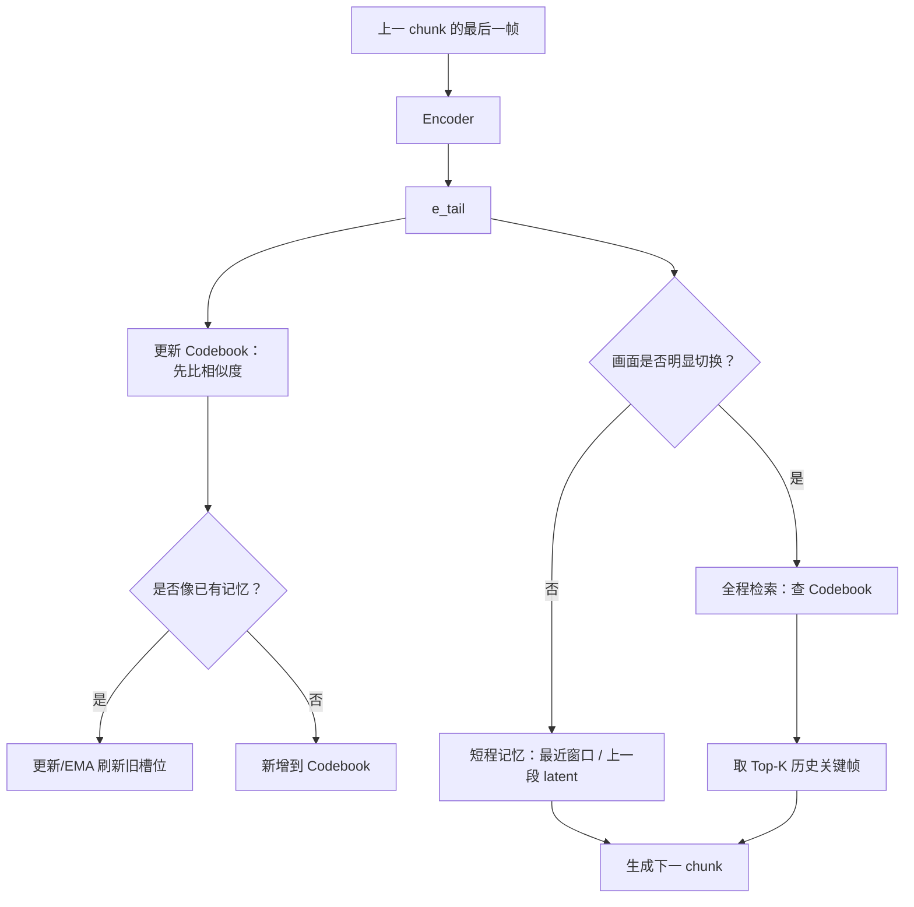
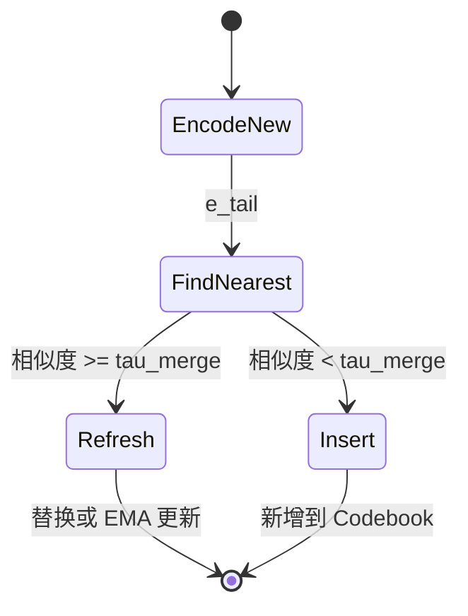

# LongMemory：按需唤醒的长程视觉记忆

这个想法可以用一句话概括：**视频生成时，不要把所有历史画面都一直塞给模型，也不要每一步都去翻完整历史；平时只靠最近的画面保持连续，只有当系统发现画面发生了明显切换时，才去长程记忆里找“以前有没有类似的画面”。** 更具体一点：在生成下一个 chunk 之前，真实的“新 chunk 第一帧”还不存在，所以我们用**上一个 chunk 的最后一帧**来近似代表“下一段即将开始时的视觉状态”。这帧过 encoder 得到 embedding 后，一方面可以拿来更新 codebook，另一方面也可以拿来判断是否发生了大切换；如果触发大切换，就用它去 codebook 里找最像的历史关键帧；如果没有触发，就不查全局，只走短程记忆。codebook 本身也会在线更新：如果这个 embedding 和已有槽位很像，就刷新那个槽位；如果不像，就当成新内容加进去。

这套东西的核心不是“存更多”，而是**什么时候该回忆、回忆什么、怎么把重复记忆压缩掉**。

## 整体流程

可以把它想成两个动作共用同一个信号：这个信号就是**上一个 chunk 的最后一帧**。它是当前时刻已经生成出来、最接近下一段开头的画面，所以既可以用来**更新记忆**，也可以用来**决定要不要读长程记忆**。

写记忆不是“无脑写入”。上一 chunk 的最后一帧先过 encoder，得到 `e_tail`，然后和 codebook 里已有的 embedding 比相似度。如果最像的那一项已经足够像，就更新那个槽位；如果都不像，才新增一条。读记忆则更谨慎：不是每次生成都读全局，而是先判断画面是不是发生了较大变化。

如果画面变化不大，比如同一个人物继续走路、镜头只是轻微移动，那模型主要依赖最近几个 chunk 或上一段 latent 就够了。这个时候去查完整 codebook，反而可能把很久以前但外观相似的画面拉回来，造成误匹配。而且速度慢。

如果画面突然切到新场景、新景别、新人物，或者主体重新出现，这时候才触发全程检索。也就是说，`e_tail` 先被拿来做“是否切换”的判断；一旦判断为大切换，它又会作为 query 去 codebook 里找最像的历史关键帧。




## Codebook 怎么更新

codebook 可以理解成一个“视觉记忆本”，里面是一个个 embedding。这里写入 codebook 的对象，用**上一个 chunk 的最后一帧模拟新视频的第一帧**，因为它是推理时真实可见的画面，也最接近下一段开头（我们任务自动切镜发生在chunk内部，chunk之间被建模为不切镜）。只有当生成已经完成、并且你明确拿得到某个 shot 的首帧时，才可以把 shot 首帧作为额外的入库样本。

当上一 chunk 的尾帧进来时，先把它编码成 `e_tail`，然后和 codebook 里已有的 embedding 算相似度。如果最像的那一项已经足够像，比如相似度超过 `τ_merge`，说明这不是一个全新的东西，而是旧记忆的新版本。此时可以直接把旧槽位替换成新 embedding，或者更稳一点，用 EMA 更新：

```text
c_i = alpha * e_tail + (1 - alpha) * c_i
```

如果它和所有旧记忆都不够像，说明出现了新场景、新角色状态或新视觉模式，就把它作为新条目加入 codebook。这里的顺序很重要：**先比相似度，再决定更新还是新增**。codebook 如果有容量上限，再用 LRU（“最近最少被使用”）、LFU（“最少使用频率”） 或“很久没被命中过的先删”来腾位置。

这里我更建议用 **EMA** 而不是直接替换。直接替换很简单，但容易被某一帧的噪声带偏；EMA 更像“慢慢更新印象”，比较符合长程记忆的直觉。




## 为什么要加“切换门控”

这个点很关键：**长程记忆不应该每一步都查**。

视频里大量片段其实是连续的。连续片段里，最可靠的信息往往就是上一段本身；这时查全局记忆不仅浪费算力，还可能引入错误参照。比如当前画面只是一个人从左走到右，全局检索可能找到之前某个“同样颜色衣服的人”，结果反而破坏当前运动连续性。

所以更合理的方式是：先用一个轻量的 cut detector 判断画面是否发生了明显切换。这个 detector 可以很简单，比如比较相邻 chunk 边界帧的 embedding 距离：

```text
d = 1 - cos(E(frame_prev), E(frame_curr))

if d >= tau_cut:
    查全程 codebook
else:
    只用短程记忆
```

也可以更稳一点，把 embedding 距离、SSIM/直方图变化、TransNetV2 这类 shot boundary detector 结合起来。实际做实验时，可以先从最简单的 embedding 距离开始；如果误触发太多，再加传统视觉信号或分镜检测。

## 更优雅的数据结构

从工程上看，这个模块最好不要写成一堆散乱函数，而是封成一个 `LongMemoryStore`。它内部有三块东西：一个短程缓冲区，存最近几个 chunk 的 embedding；一个长程 codebook，存历史关键帧原型；一个门控函数，决定这次要不要查长程。

```text
LongMemoryStore
  - recent: 最近 W 个 chunk 的 embedding
  - codebook: 长程视觉原型库
  - meta: 每个原型对应的 shot_id、时间、命中次数等
  - should_retrieve(e_prev, e_curr) -> bool
  - retrieve_if_needed(e_tail, topk) -> Optional[results]
  - update(e_tail) -> updated_slot_or_new_slot
```

如果 codebook 很小，比如几百到几千条，直接用一个 `[N, D]` 的 tensor 做矩阵乘法就够了，简单、可控、方便调试。若 codebook 变到上万甚至更多，再考虑 Faiss 或 HNSW。Faiss 更像标准向量库，适合批量查；HNSW 对在线插入更友好。

我会把它理解成 **“门控式向量检索”**，而不是传统意义上的“块状搜索”。“块状搜索”容易让人想到把数据分块后在块里扫，这和这里的重点不太一样。这里的重点是：**chunk 尾帧触发检索，codebook 负责长程记忆，cut gate 决定要不要查全局**。如果要起一个更准确的英文名，可以叫：

```text
Cut-Gated Long Memory Retrieval
```

或者更完整一点：

```text
Cut-Gated Chunk-Conditioned Keyframe Memory
```

## 和 OneStory 的关系

OneStory 的 Frame Selection 是一个训练出来的模块，它会根据当前 caption 和历史视觉 memory 学习选帧。你的想法更像一个轻量、可解释、偏工程化的长程记忆系统：不一定要端到端训练 selector，而是用关键帧、embedding、相似度阈值和切换门控来做在线记忆管理。

两者并不冲突。OneStory 更像“模型自己学会看哪里”，你的方案更像“先给模型一个整理好的记忆本，并且只有需要的时候才翻”。如果后面要结合，可以让 codebook 检索出来的 Top-K 关键帧进入 conditioner，或者作为额外 reference 提供给视频生成模型。

## 还需要定的几个问题

这里有几个设计点后面要靠实验拍板。第一，入库帧到底只用上一 chunk 尾帧，还是在 shot 结束后也补充 shot 首帧；我倾向于先用尾帧，因为它推理时最自然、和下一段开头最贴近。第二，`τ_cut` 和 `τ_merge` 怎么设：前者决定什么时候查全程，后者决定什么时候合并记忆。第三，短程记忆到底存什么：可以是最近 `W` 个 chunk 的 embedding，也可以是上一段 latent，或者两者都存。第四，检索出来的 Top-K 怎么喂给生成器：直接作为 reference frame、变成 tokens 走 cross-attention，还是只拿最近的一个。

我的建议是先做一个最小版本：**上一 chunk 尾帧入库、先判相似度再 EMA 更新或新增、embedding 距离触发全程检索、Top-K=1 或 3**。等这个跑通后，再加更复杂的 cut detector、更大的向量索引，或者再实验是否补充 shot 首帧。

优势：只需要训一个lora？

## 其他范式探索

关于查询范式：
F(text，visual)->emb，search similar
关于memory存取方式：
1. 帧级别，当前帧和历史帧直接输入到vlm中，又vlm输出的last hidden states作为记忆表征
2. 采用clip实现上面的范式
关于history reference：
1. 直接替换long的最后几个token
2. 通过ca的方式注入
关于next chunk prediction：
1.使用一个长视频理解模型，先以qwenvl为例，直接预测出下一个token的模糊轮廓